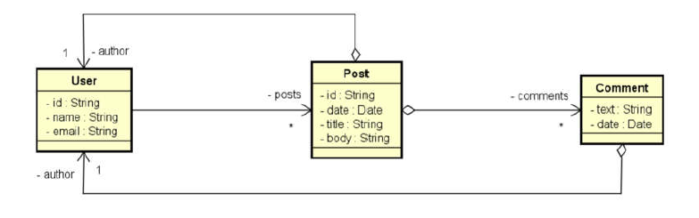

# 🧾 Back end - Make Post

A api foi desenvolvida durante um curso do professor [Nelio](https://github.com/acenelio) como prática para conceitos de api
rest com utilização do ecossistema spring e do mongodb.

**Atenção**: Você precisa ter o java jdk 11 instalado na sua máquina bem como o `PATH_VARIABLE` do java configurado e uma IDE de sua preferência.

**O back end está utilizando o mongodb e é necessário ter instalado na máquina local. Verifique
as configurações de conexão em `src/main/resources/application.properties`.**


Execute o comando: `mvn install` para instalar as dependências do maven.

Após baixar as dependências, execute a aplicação e a api estará rodando em http://localhost:8080.


## 🗺️ Diagrama de Classes - Modelo de Domínio



## 📌 Endpoints

Os seguintes endpoints estão configurados:

### Posts
- `/posts/{id}` - GET - Exibe um post específico, informações do autor e os 
  comentários.

### Users
- `/users` - GET - Exibe todos os usuários cadastrados.
- `/users/{id}` - GET - Exibe um usuário específico através do seu Id.
- `/users/{id}/posts` - GET - Exibe os posts de um usuário específico (em que o mesmo é o autor) 
  através do seu Id.
- `/users/{id}` - DELETE - Remove um usuário a partir do seu Id.
- `/users` - POST - Cria um usuário.
- `/users/{id}` - PUT - Atualiza as informações de um usuário (Nome e email).

**Exemplo de dados para CRIAR um Usuário (JSON)**

```json
{
  "name": "any_name",
  "email": "any_email@email.com"
}
```

**Exemplo de dados para ATUALIZAR um Usuário (JSON)**

```json
{
  "name": "any_name_edit",
  "email": "any_email_edit@email.com"
}
```

## 🛠️ Ferramentas
1. Java
2. Spring Web
3. Spring Data Mongodb

## 💾 Dados para povoar a api
O arquivo em `src/main/config` é um arquivo de configuração para o povoamento de dados na API.
Na medida em que a aplicação é inicializada, os dados vão sendo inseridos graças a anotação
**@PostConstruct**.